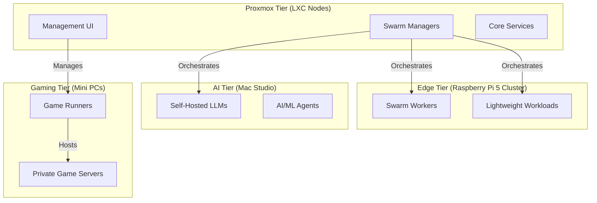

# Data Fortress: Multi-Tier Swarm & Game Cluster

Welcome to the **Data Fortress**, a high-performance, resource-efficient, and fully declarative home lab environment currently transitioning from Kubernetes to Docker Swarm.

## 🏗️ Architecture Overview (Target State)

The Data Fortress is designed to be distributed across specialized hardware tiers to optimize for CPU, RAM, and specialized AI/Gaming workloads. See `TODO.md` for the current migration status.



### Hardware Tiers (In Progress)

1. **Proxmox Tier**: Virtualized LXC nodes on Proxmox VE. Hosts the Swarm managers and core infrastructure (Traefik).
1. **Edge Tier**: A cluster of **Raspberry Pi 5** nodes. Optimized for distributed, low-power horizontal scaling of web services.
1. **AI Tier**: Dedicated hardware (e.g., Mac Studio) for hosting local large language models (LLMs) and supporting agentic workflows.
1. **Gaming Tier**: High-performance nodes acting as game server runners.

## 🚀 GitOps & Automation

This cluster utilizes a **GitOps** workflow for seamless deployments:

- **`swarm-cd`**: Automatically reconciles stack definitions from this repository to the Swarm cluster.
- **Cluster Configuration**: Located in `docker/clusters/adams/`, defining the source of truth for deployed services via `stacks.yml`.
- **Infrastructure as Code**: All services are defined as Docker Compose stacks in `docker/stacks/`.

## 📂 Repository Structure

| Path | Purpose |
| ------------ | --------------------------------------------- |
| `docker/stacks/` | Declarative Docker Compose stack definitions. |
| `docker/clusters/` | Cluster-specific configurations and GitOps definitions. |
| `lancedb/` | Vector database storage for agent memory. |
| `TODO.md` | Migration roadmap from Kubernetes (Talos) to Swarm. |

## 🔐 Secret Management

We maintain a strict distinction between developer and service secrets:

- **Developer Secrets**: Managed via environment variables and `.envrc` (using `direnv`).
- **Service Secrets**: Encrypted via `sops` or managed as native Docker secrets. See stack definitions for specific implementations.

## 🛠️ Getting Started

### 1. Enter the Environment

Ensure you have `direnv` and `docker` installed.

```bash
direnv allow
```

### 2. Management Tools

- `docker`: Directly interact with the Swarm manager.
- `sops`: For secret encryption/decryption (requires age key).
- `trunk`: For linting and formatting.

______________________________________________________________________

For detailed contribution guidelines, see [**`CONTRIBUTING.md`**](CONTRIBUTING.md).
For AI Agent specific context, see [**`AGENTS.md`**](AGENTS.md).

