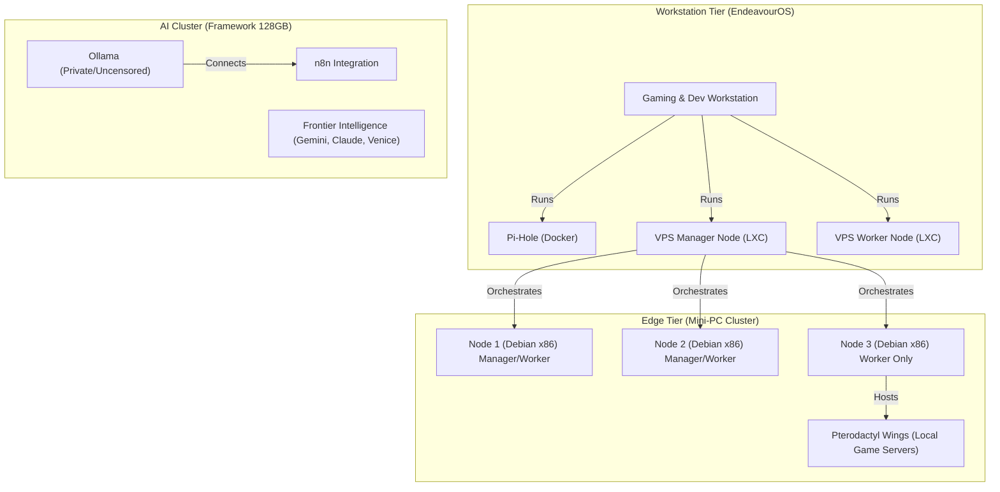

# Data Fortress: Multi-Tier Swarm & Game Cluster

Welcome to the **Data Fortress**, a high-performance, resource-efficient, and fully declarative home lab environment powered by Docker Swarm. This repository serves as the single source of truth for the entire cluster's configuration and deployment.

## 🏗️ Architecture Overview

The Data Fortress is distributed across specialized hardware tiers to optimize for productivity, privacy, and gaming, leveraging a mix of local resources and frontier AI intelligence.

### Hardware Tiers

1.  **Workstation Tier**: A high-spec EndeavourOS desktop serving as a primary workstation and gaming PC. It hosts LXC containers for core management (`vps-manager`, `vps-worker`) and network services (`pi-hole` on Docker).
2.  **Edge Tier**: A cluster of three **Debian x86 Mini-PCs** (16GB RAM each). Nodes 1 and 2 operate as both Swarm managers and workers, while Node 3 acts as a dedicated worker hosting **Pterodactyl Wings** for local game server deployment.
3.  **AI Cluster**: A **Framework 128GB** laptop running **Ollama** for free, private, and uncensored agentic workflows. This local cluster integrates with **n8n** and leverages external frontier intelligence from **Gemini API**, **Claude (Anthropic)**, **Venice AI** (Web3 integrated), and **OpenRouter**.

## 🚀 GitOps & Automation

This cluster utilizes a **GitOps** workflow for seamless, declarative deployments:

-   **`swarm-cd`**: Automatically reconciles stack definitions from this repository to the Swarm cluster.
-   **Cluster Configuration**: Located in `docker/clusters/adams/`, defining the source of truth for deployed services via `stacks.yml`.
-   **Infrastructure as Code**: All services are defined as Docker Compose stacks in `docker/stacks/`.

## 🔐 Secret Management

We maintain a strict distinction between developer and service secrets:

-   **Developer Secrets**: Managed as local environment variables (e.g., in a `.env` file or shell session). these are for tools interacting with the cluster or external APIs.
-   **Service Secrets**: Encrypted via `sops` or managed as native Docker secrets. Service-specific secrets are located within their respective stack directories.

## 🛠️ Getting Started

### 1. Environment Setup

Ensure you have `docker`, `sops`, and `trunk` installed.

### 2. Management Tools

-   `docker`: Directly interact with the Swarm manager.
-   `sops`: For secret encryption/decryption (requires a configured age key).
-   [trunk](https://trunk.io): For linting and formatting compliance across the repository.

---

For detailed contribution guidelines, see [**`CONTRIBUTING.md`**](CONTRIBUTING.md).
For AI Agent specific context, see [**`AGENTS.md`**](AGENTS.md).
