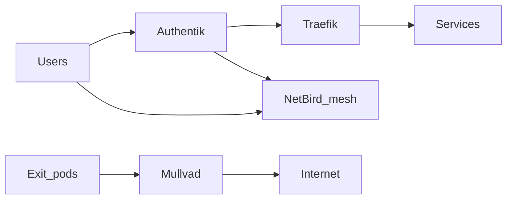

# Guenivir Cluster GitOps

GitOps repository for a personal homelab **Kubernetes** stack. Production runs **k3s** on three mini PCs (all server nodes) for basic high availability. A **k3d** cluster applies the **same Flux path and manifests** so changes can be exercised locally before production.

**Stack and runbooks:** [docs/](docs/README.md) (per-component pages). **Editor and agent tooling:** [AGENTS.md](AGENTS.md).

## Repository and Flux source

The Flux `GitRepository` in [`k3s/clusters/testing/flux-system/gotk-sync.yaml`](k3s/clusters/testing/flux-system/gotk-sync.yaml) points at `https://github.com/soriphoono/cluster.git`. This checkout may live under a different directory name (for example `guenivir`); the reconciled path is always `./k3s/clusters/testing` on the branch Flux tracks.

## What Flux deploys today

Reconciliation entrypoint: [`k3s/clusters/testing`](k3s/clusters/testing) (see [`infrastructure.yaml`](k3s/clusters/testing/infrastructure.yaml)).

| Layer | Role |
| --- | --- |
| **Flux** | Watches the Git repository and applies `Kustomization` resources. |
| **Controllers** ([`k3s/infrastructure/controllers`](k3s/infrastructure/controllers)) | Helm repositories, [**Cloudflare operator**](https://github.com/adyanth/cloudflare-operator) ([`cloudflare-operator/`](k3s/infrastructure/controllers/cloudflare-operator)), **Traefik** ([`traefik/traefik.yaml`](k3s/infrastructure/controllers/traefik/traefik.yaml)), **cert-manager** ([`cert-manager.yaml`](k3s/infrastructure/controllers/cert-manager.yaml)). |
| **Cloudflare tunnels** ([`k3s/infrastructure/cloudflare`](k3s/infrastructure/cloudflare)) | Flux `Kustomization` **`infra-cloudflare`** (after controllers): ClusterTunnel, wildcard **TunnelBinding** → Traefik, SOPS secret for the API token. Replace placeholders per [docs/cloudflare-operator.md](docs/cloudflare-operator.md). |
| **Configs** | [`k3s/infrastructure/configs`](k3s/infrastructure/configs) is reserved for manifests layered after controllers (for example extra `Ingress` or `IngressRoute` objects). The Flux `Kustomization` for that path is commented out in [`infrastructure.yaml`](k3s/clusters/testing/infrastructure.yaml). |

Details: [docs/flux-and-clusters.md](docs/flux-and-clusters.md), [docs/cloudflare-operator.md](docs/cloudflare-operator.md), [docs/traefik.md](docs/traefik.md), [docs/cert-manager.md](docs/cert-manager.md).

**Dashboard:** Traefik’s API/dashboard is enabled in the Helm values. Exposure is whatever you add under `configs/` or via separate ingress objects; the intended direction is **Authentik** as the **identity authority** for the network (OIDC for **NetBird**, ForwardAuth or similar for **Traefik** and other UIs) plus **NetBird** for mesh access—see the roadmap and linked docs.

## Roadmap

| Goal | Doc |
| --- | --- |
| Self-hosted **NetBird** control plane on-cluster | [docs/netbird.md](docs/netbird.md) |
| **Five exit-node** workloads; each pod routes egress through **Mullvad** (Tailscale-style “exit via VPN vendor”) | [docs/netbird.md](docs/netbird.md) |
| **Authentik** as **IdP** for **NetBird** and SSO / reverse-proxy auth for Traefik and other services | [docs/authentik.md](docs/authentik.md) |
| **CloudNativePG** operator for PostgreSQL | [docs/cloudnativepg.md](docs/cloudnativepg.md) |


```mermaid
flowchart LR
  users[Users]
  auth[Authentik]
  traefik[Traefik]
  svc[Services]
  nb[NetBird_mesh]
  exit[Exit_pods]
  mv[Mullvad]
  inet[Internet]
  users --> auth
  auth --> traefik
  auth --> nb
  traefik --> svc
  users --> nb
  exit --> mv
  mv --> inet
```

## Repository layout

```
k3s/                              # Flux-managed cluster config
├── clusters/
│   └── testing/                  # Flux bootstrap path (same stack as prod)
│       ├── flux-system/          # Flux sync (often generated by flux bootstrap)
│       ├── infrastructure.yaml   # Infra Kustomizations (controllers / configs)
│       └── kustomization.yaml
├── infrastructure/
│   ├── controllers/              # Helm releases, Helm repos, Cloudflare operator (remote kustomize)
│   │   ├── source/
│   │   ├── traefik/
│   │   └── cloudflare-operator/
│   ├── cloudflare/               # ClusterTunnel, TunnelBinding → Traefik, SOPS API token
│   └── configs/                  # Optional second layer (enable in infrastructure.yaml)
docs/                             # Per-stack documentation (see docs/README.md)
```

There is no `k3s/apps/` tree yet; application workloads can be added alongside new Flux `Kustomization` entries when needed.

## Getting started

```bash
direnv allow    # optional: load dev shell via .envrc
nix develop     # enter dev shell
nix run         # create k3d cluster, bootstrap Flux against this repo’s testing path
```

Formatting, linting, pre-commit, and agent-oriented commands: **[AGENTS.md](AGENTS.md)**.

## Encrypting secrets

- **Cluster (`k3s/`)**: use SOPS-encrypted manifests; Flux decrypts using the `sops-age` secret. See [docs/gitops-and-secrets.md](docs/gitops-and-secrets.md).
- **Developer secrets**: use **age** and **agenix-shell** as configured in the flake; full notes live in [docs/gitops-and-secrets.md](docs/gitops-and-secrets.md).

Quick cluster secret example:

```bash
kubectl create secret generic my-secret \
  --from-literal=key=value \
  --dry-run=client -o yaml > k3s/infrastructure/controllers/my-secret.sops.yaml
sops -e -i k3s/infrastructure/controllers/my-secret.sops.yaml
```

(Adjust path to match the Flux `Kustomization` that should include the file.)
