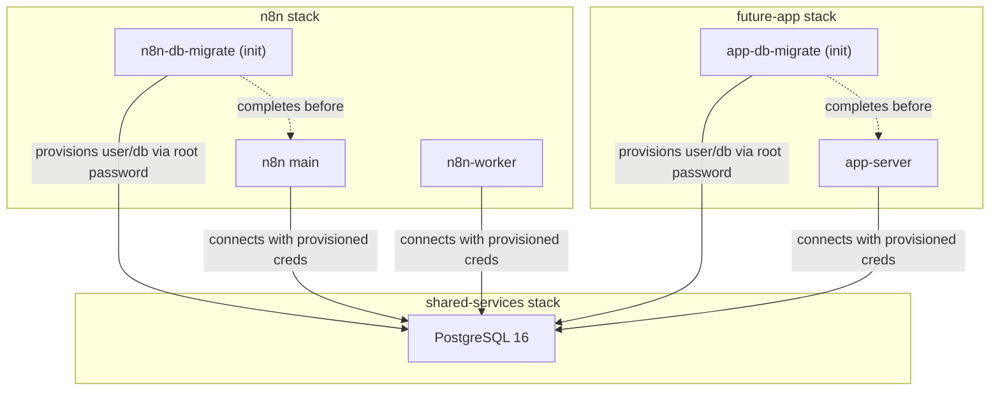
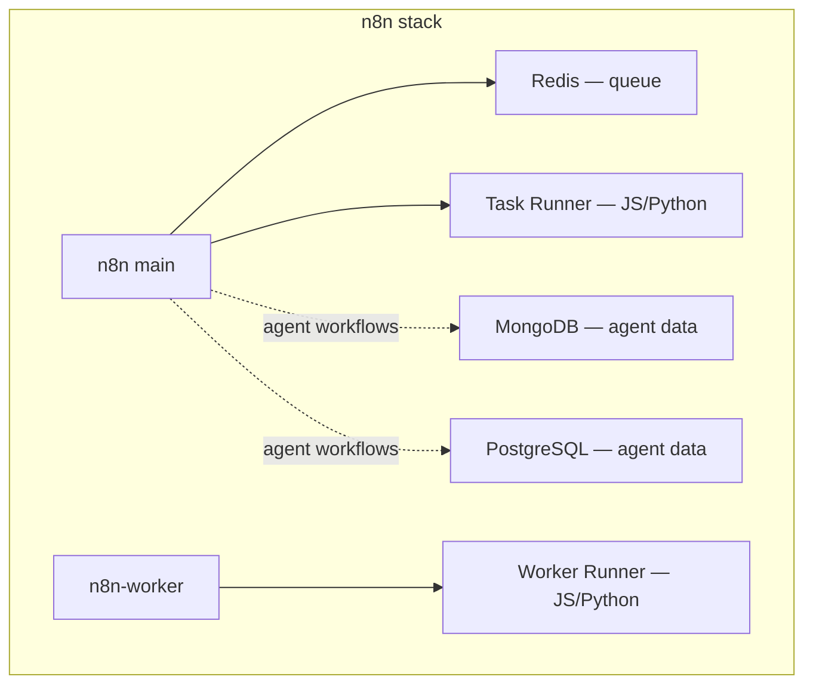
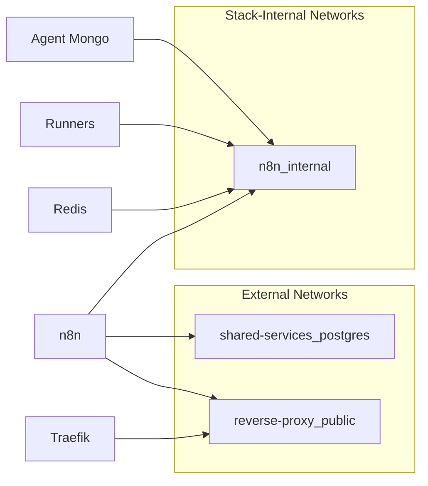

# Microservice Deployment Architecture

This document defines the deployment philosophy for the **Data Fortress** cluster. All services follow a microservice model with clear separation between **shared resources** and **satellite containers**.

---

## Deployment Tiers

The Data Fortress uses a two-tier deployment model based on service criticality:

### Core Tier — `swarm-cd` + `stacks.yml`

Deployed automatically via GitOps. These are foundational stacks that the cluster cannot function without:

| Stack | Purpose |
|---|---|
| `reverse-proxy` (Traefik) | Ingress, TLS termination, routing |
| `portainer` | Cluster management UI, GitOps engine |
| `shared-services` | Shared PostgreSQL |
| `shepherd` | Automatic Docker image updates |

Core stacks are registered in `docker/clusters/adams/stacks.yml` and reconciled by `swarm-cd`.

### Application Tier — Portainer GitOps (Opt-In)

Non-core service stacks deploy via **Portainer's GitOps integration**, allowing per-stack opt-in control:

- Each stack lives in `docker/stacks/<name>/` in the repository.
- Portainer watches the repo and deploys stacks on demand.
- This allows selective deployment — not every stack deploys to every environment.
- Examples: `n8n`, future stacks for monitoring, CI runners, etc.

> **Why not swarm-cd for everything?** Core infrastructure must always be running and auto-reconciled. Application stacks benefit from manual opt-in so operators can selectively enable services per cluster/node without maintaining separate `stacks.yml` per environment.

---

## Shared Resources Pattern

Shared resources are **centralized infrastructure services** that multiple application stacks depend on. They are deployed once and consumed by many.

### Rules

1. **One instance, many consumers** — A single PostgreSQL instance serves all stacks. No bundled databases for services that need a standard relational backend.
2. **Migration-based provisioning** — Each consuming stack includes an init container (e.g., `n8n-db-migrate`) that runs a bash script to create its user, database, and grant permissions using the shared PostgreSQL root password. This is idempotent and safe to re-run.
3. **Network isolation** — Shared services expose an overlay network (e.g., `shared-services_postgres`) that consuming stacks attach to as `external: true`.
4. **Init container dependency** — Application services use `depends_on: condition: service_completed_successfully` to wait for their migration init container before starting.

---

## Satellite Pattern

Satellites are **tightly-coupled ancillary containers** that exist only to serve their parent service. They are deployed inside the parent's stack, not as separate shared services.

### Rules

1. **One satellite per container definition** — If n8n agents need MongoDB, there is one `n8n-agent-mongo` container, not one per agent. The satellite serves all consumers of that type within the stack.
2. **Same lifecycle as parent** — Satellites deploy, scale, and tear down with their parent stack. They have no independent existence.
3. **Internal network only** — Satellites communicate with their parent on an internal overlay network. They are never exposed externally or to other stacks.
4. **Stack-scoped volumes** — Satellite data volumes are scoped to the parent stack (e.g., `n8n_agent_mongo_data`), not shared globally.

### When to Satellite vs. Share

| Signal | Shared Resource | Satellite |
|---|---|---|
| Multiple stacks need it | ✅ | ❌ |
| Tightly coupled to one service | ❌ | ✅ |
| Needs centralized credential management | ✅ | ❌ |
| Data is service-private | ❌ | ✅ |
| Failure impacts many services | ✅ | ❌ |
| Can be torn down with parent | ❌ | ✅ |

---

## Network Architecture

- **`reverse-proxy_public`** — Traefik's public overlay. Services attach to receive HTTPS ingress.
- **`shared-services_postgres`** — Shared PostgreSQL network. Consuming stacks attach as external.
- **`<stack>_internal`** — Per-stack internal overlay for satellite communication. Never exposed.

---

## Secret Management

| Secret Type | Mechanism | Example |
|---|---|---|
| Shared DB root password | SOPS → Docker secrets | PostgreSQL root password |
| App DB credentials | SOPS → Docker secrets | n8n user/password (provisioned by migration) |
| Service encryption keys | SOPS → Docker secrets | n8n encryption key |
| Inter-service auth tokens | SOPS → Docker secrets | Task runner auth token |

All SOPS-encrypted files live in `docker/stacks/<name>/secrets/` and are matched by `.sops.yaml` creation rules.
