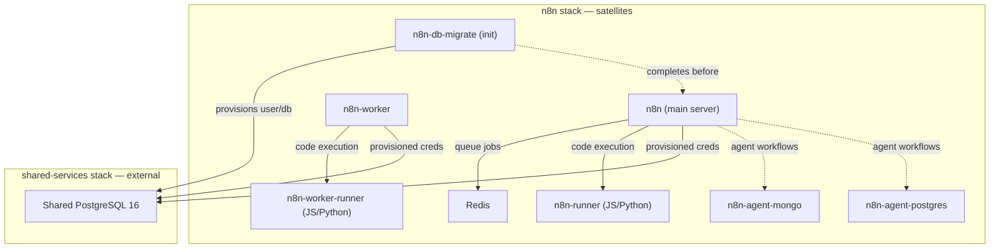

# N8N Stack Deployment

Deployment specification for the **n8n automation platform** within the Data Fortress, following the [Microservice Deployment Architecture](Microservice%20Deployment%20Architecture.md).

**Reference**: [n8n-io/n8n-hosting — withPostgresAndWorker](https://github.com/n8n-io/n8n-hosting/tree/main/docker-compose/withPostgresAndWorker)

---

## Deployment Model

- **Tier**: Application (Portainer GitOps opt-in, not swarm-cd)
- **Domain**: `automation.ts.cryptic-coders.net` via Traefik `dnsresolver`
- **Stack path**: `docker/stacks/n8n/`

---

## Component Breakdown



| Service | Image | Role | Type |
|---|---|---|---|
| `n8n-db-migrate` | `postgres:16` | Provisions n8n user/database on shared PG | Init |
| `n8n` | `docker.n8n.io/n8nio/n8n` | Main server, web UI, webhook receiver | Core |
| `n8n-worker` | `docker.n8n.io/n8nio/n8n` | Queue worker (executes workflows) | Satellite |
| `n8n-runner` | `n8nio/runners` | JS/Python code execution for main | Satellite |
| `n8n-worker-runner` | `n8nio/runners` | JS/Python code execution for worker | Satellite |
| `redis` | `redis:7-alpine` | Bull queue backend | Satellite |
| `n8n-agent-mongo` | `mongo:7` | MongoDB for agent workflow data | Satellite |
| `n8n-agent-postgres` | `postgres:16-alpine` | PostgreSQL for agent workflow data | Satellite |

---

## Database Strategy

### Primary Database — Shared PostgreSQL (External)

N8N's core database (workflow definitions, credentials, execution history) connects to the **shared PostgreSQL** instance from the `shared-services` stack.

**Connection flow**:

1. The `n8n-db-migrate` init container runs `migrate-n8n-db.sh` which connects to the shared PostgreSQL using the root password secret.
2. The script creates the `n8n` user and `n8n` database (idempotent — safe to re-run).
3. N8N services depend on `n8n-db-migrate` via `service_completed_successfully`.
4. N8N connects via the `shared-services_postgres` external overlay network using the provisioned credentials.
5. N8N manages its own schema migrations on startup (built-in).

**Key files**:

- `migrate-n8n-db.sh` — Idempotent bash script that provisions user/database/permissions.
- `secrets/n8n_db_password` — SOPS-encrypted password for the provisioned n8n user.
- `secrets/postgres_root_password` — Referenced from `../shared-services/secrets/` for the migration.

### Agent Databases — Satellites (Internal)

Agent workflows in n8n may need their own databases for storing and querying data (RAG documents, structured data, etc.). These are **satellites**:

- **`n8n-agent-mongo`** — One MongoDB instance for all agent workflows needing document storage.
- **`n8n-agent-postgres`** — One PostgreSQL instance for all agent workflows needing relational storage.

These are isolated on the `n8n_internal` overlay network and only accessible by n8n services.

---

## Network Topology

| Network | Type | Purpose |
|---|---|---|
| `reverse-proxy_public` | External overlay | Traefik ingress (HTTPS) |
| `shared-services_postgres` | External overlay | Access to shared PostgreSQL |
| `n8n_internal` | Internal overlay | Satellite communication (Redis, runners, agent DBs) |

---

## Secrets

| Secret | Source | Purpose |
|---|---|---|
| `n8n_encryption_key` | SOPS | Encrypts stored credentials in n8n |
| `runners_auth_token` | SOPS | Shared auth between n8n ↔ task runners |
| `n8n_db_password` | SOPS | Password for provisioned n8n PostgreSQL user |
| `n8n_agent_postgres_password` | SOPS | Password for agent satellite PostgreSQL |
| `postgres_root_password` | SOPS (from shared-services) | Used by migration container only |

---

## Traefik Integration

```yaml
labels:
  - traefik.enable=true
  - traefik.http.routers.n8n.rule=Host(`automation.ts.cryptic-coders.net`)
  - traefik.http.routers.n8n.entrypoints=websecure
  - traefik.http.routers.n8n.tls.certresolver=dnsresolver
  - traefik.http.services.n8n.loadbalancer.server.port=5678
```

---

## File Structure

```
docker/stacks/n8n/
├── docker-compose.yml
├── migrate-n8n-db.sh
└── secrets/
    ├── n8n_encryption_key
    ├── runners_auth_token
    ├── n8n_db_password
    └── n8n_agent_postgres_password
```
